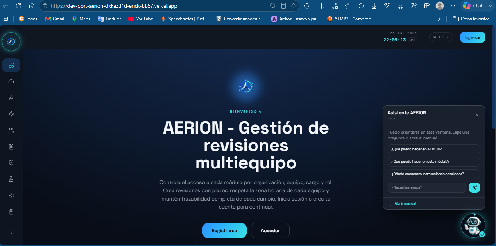
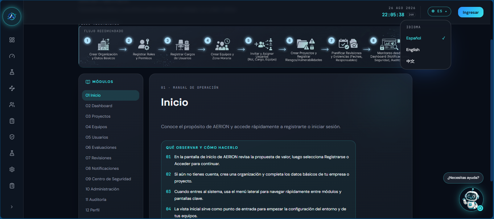
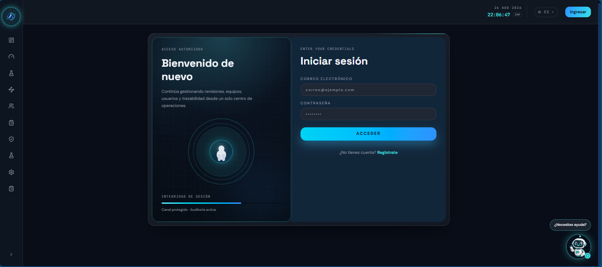
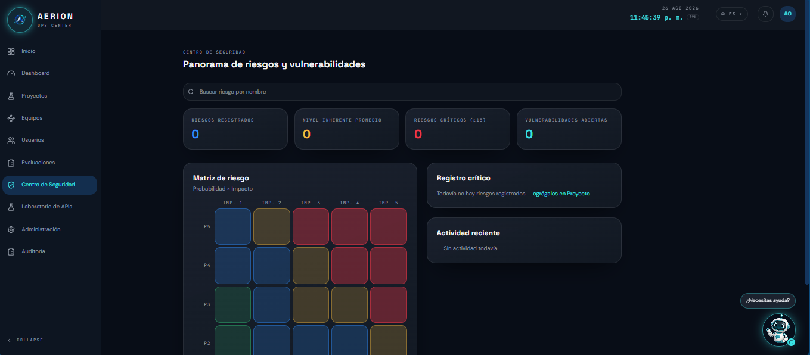

# AERION

Gestión de revisiones, actividades y usuarios por organización, equipo,
cargo y rol. Cada equipo puede tener su propia zona horaria y sus propios
plazos, con trazabilidad completa de cada cambio.

## Deploy on Vercel

Demo en vivo: [DevPort-Aerion](https://dev-port-aerion-7ys0cy1z8-erick-bb67.vercel.app/)

## Capturas de Pantalla
Pantalla de Inicio:
   

Manual:
   

Pantalla de iniciar sesión:
   

Pantalla de Centro de Seguridad:
   

## Sustentación

Video de defensa: [Sustentación DevPort Aerion](https://ister-my.sharepoint.com/:v:/g/personal/erick_clavijo_ister_edu_ec/IQD62tHETROxTpiz-iUUvnbUAQ0k-U73wzSOvPh3wd7KrXM?nav=eyJyZWZlcnJhbEluZm8iOnsicmVmZXJyYWxBcHAiOiJPbmVEcml2ZUZvckJ1c2luZXNzIiwicmVmZXJyYWxBcHBQbGF0Zm9ybSI6IldlYiIsInJlZmVycmFsTW9kZSI6InZpZXciLCJyZWZlcnJhbFZpZXciOiJNeUZpbGVzTGlua0NvcHkifX0&e=m8uNnt)
Enlace de Diapositivas: [Presentación DevPort Aerion](https://ister-my.sharepoint.com/:b:/g/personal/erick_clavijo_ister_edu_ec/IQCvdiEqF9sMRb4MHfIkKNKKAVc-XDsKZD9rmK1J2-kVylA?e=VNGLz4)

## Stack tecnológico

- Next.js 14.2 (App Router)
- TypeScript 5
- Tailwind CSS 3.4
- Supabase (PostgreSQL + Auth + Storage)
- TimeZoneDB (API externa de zonas horarias)
- Vercel (deploy)

## Roles de usuario

| Rol | Alcance | Qué puede hacer |
|---|---|---|
| **Superadmin** | Toda la organización | Control total: crea/edita cualquier equipo, usuario, cargo o rol |
| **Admin. organización** | Toda la organización | Igual que Superadmin salvo tareas reservadas al dueño de la cuenta |
| **Admin. equipo** | Un equipo específico | Administra usuarios y revisiones solo dentro de su equipo |
| **Supervisor** | Un equipo específico | Crea y gestiona revisiones de su equipo, no administra usuarios |
| **Revisor** | Un equipo específico | Es responsable de revisiones asignadas: puede iniciarlas y finalizarlas |
| **Consulta** | Un equipo específico | Solo lectura dentro de su equipo |

Un mismo usuario puede tener roles distintos en equipos distintos (ej.
Supervisor en un equipo y Consulta en otro) — cada asignación es
independiente.

## Modelo de datos

12 tablas relacionadas (ver `AERION_Script_SQL.sql` para el detalle completo):

- **organizaciones** → **equipos** → **asignaciones** (usuario + equipo + cargo + rol)
- **profiles** extiende `auth.users` (1:1)
- **roles** ↔ **permisos** (N:M vía `roles_permisos`)
- **revisiones** (recurso principal) → **revision_eventos** (trazabilidad) y **evidencias** (archivos en Storage, solo se guarda la ruta)
- **auditoria** y **notificaciones**, independientes

El estado de una revisión (No iniciada / En proceso / Finalizada en plazo /
Finalizada fuera de plazo / Vencida) se calcula en tiempo real con una
función SQL, no se guarda como columna fija.

## Instalación local

```bash
git clone <https://github.com/Erick-Cl17/DevPort-Aerion.git>
cd aerion
npm install
cp .env.local
npm run dev
```

## Getting Started

First, run the development server:

```bash
npm run dev
# or
yarn dev
# or
pnpm dev
# or
bun dev
```

## Variables de entorno

| Variable | Para qué sirve |
|---|---|
| `NEXT_PUBLIC_SUPABASE_URL` | URL del proyecto de Supabase |
| `NEXT_PUBLIC_SUPABASE_PUBLISHABLE_KEY` | Llave pública (anon) de Supabase |
| `TIMEZONEDB_API_KEY` | Llave gratuita de timezonedb.com/register |

## Credenciales de prueba

Todas las siguientes cuentas utilizan la misma contraseña: **AerionQ8#Zx**

| Email                      | Rol                          | Nivel               | Nombre   | Apellido | Organización             | Equipo       |
|-----------------------------|------------------------------|---------------------|----------|----------|--------------------------|--------------|
| superadmin@aerion-test.com  | Superadministrador           | superadmin          | Sara     | Admin    | Organización de Prueba   | Equipo Alpha |
| adminorg@aerion-test.com    | Administrador de organización| admin_organizacion  | Andrés   | Organización | Organización de Prueba | Equipo Alpha |
| adminequipo@aerion-test.com | Administrador de equipo      | admin_equipo        | Elena    | Equipo   | Organización de Prueba   | Equipo Alpha |
| supervisor@aerion-test.com  | Supervisor                   | supervisor          | Sofía    | Supervisor | Organización de Prueba | Equipo Alpha |
| revisor@aerion-test.com     | Revisor                      | revisor             | Renato   | Revisor  | Organización de Prueba   | Equipo Alpha |
| consulta@aerion-test.com    | Consulta                     | consulta            | Carla    | Consulta | Organización de Prueba   | Equipo Alpha |

## Funcionalidades — checklist

- [x] Registro, login, logout, confirmación de cuenta por correo
- [x] Protección de rutas privadas con `proxy.ts`
- [x] Roles y permisos por organización/equipo 
- [x] Ruta dinámica `/dashboard/revisiones/[id]`
- [x] CRUD completo del recurso principal (revisiones)
- [x] Base de datos relacional con RLS activado
- [x] Consumo de API externa (TimeZoneDB) con manejo de error si no responde
- [x] Subida de evidencias a Supabase Storage 
- [x] Componente de búsqueda/filtro con `useState` (dashboard, sin consultas nuevas a Supabase)
- [x] CRUD de Cargos y Roles
- [x] Reportes de cumplimiento por equipo
- [x] Pantalla de auditoría (registra creación de equipos, revisiones, cargos, roles, asignaciones)
- [x] Notificaciones visibles en la interfaz (asignación de revisión, finalización fuera de plazo)
- [x] Menú responsive (móvil) y tablas con scroll horizontal en pantallas angostas
- [x] Rutas públicas y privadas (mínimo 2 de cada una), protegidas con middleware
- [x] Segunda API externa (Open Notify), también con manejo de error
- [x] Manejo correcto de Server Components y Client Components

## Autor

[Erick Clavijo](https://github.com/Erick-Cl17)